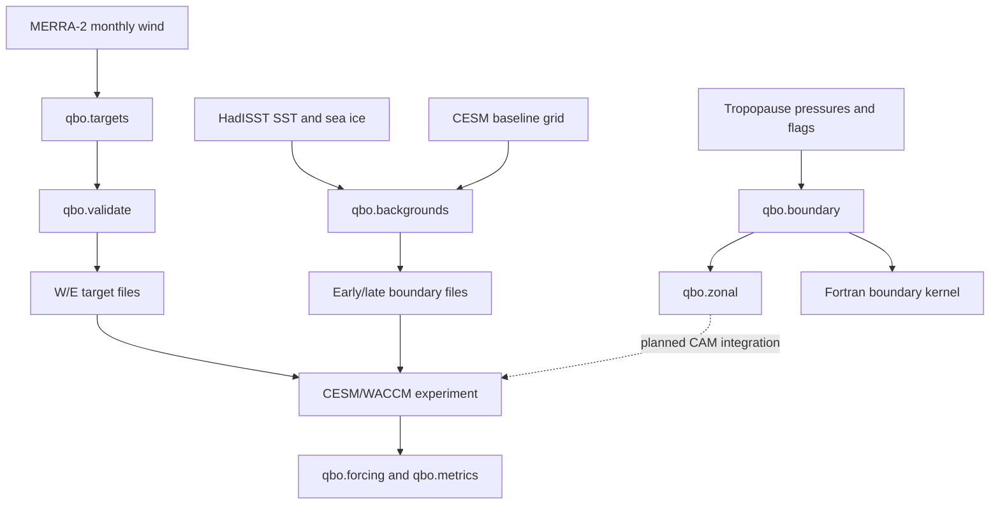

# Architecture

[中文](architecture.zh-CN.md) · [README](../README.md)

The code follows the experiment's data flow: construct inputs, compute forcing weights, compare model diagnostics, and check native interfaces.



## Module responsibilities

| Module | Responsibility |
|---|---|
| `qbo.targets` | Select QBO years and write W/E monthly profiles |
| `qbo.backgrounds` | Average HadISST by period, map grids and write boundary files |
| `qbo.validate` | Check target dimensions, coordinates, values and phase separation |
| `qbo.boundary` | Find the restrictive tropopause and apply the column taper |
| `qbo.zonal` | Reduce column weights to a longitude-uniform envelope |
| `qbo.forcing` | Reconstruct WACCM layer support and `QBO_U0`; measure overlap |
| `qbo.metrics` | Quantify retained relaxation and zonal/eddy components |
| `qbo.preconditions` | Check diagnostic namelists and hard-cutoff geometry |
| `qbo.native` | Generate boundary test vectors and verify Fortran results |
| `qbo.diagnostics` | Read an explicit snapshot and write column/zonal weights and summaries |
| `qbo.demo` | Generate synthetic inputs, run the builders and draw the workflow overview |
| `scripts/analysis/` | Read archived model evidence and produce JSON/CSV assessments |

The Python package operates on arrays and explicit file paths. Experiment-specific archive traversal lives in the analysis scripts. Native source preparation lives under `scripts/`, alongside the repository's pinned CAM source.

## Numerical conventions

Python operator inputs use **hPa** for pressure and **m s⁻¹** for wind. CAM tropopause diagnostics use Pa and are converted by the adapter or analysis script. Python arrays follow `(level, latitude, longitude)` where those axes are present; the longitude reduction always uses the last axis and keeps its length as one.

`safe_pressure` requires three pressure/found pairs: TROP, TROPP and TROPF. All three pressures must be finite and positive, with found flags greater than 0.5. It returns their minimum; invalid columns become NaN and receive zero weight.

For layer-bottom pressure `p_bottom` and safe pressure `p_safe`:

```text
x = clip(log(p_safe / (p_bottom + 0.001)) / 0.2, 0, 1)
weight = x² (3 − 2x)
```

The implementation evaluates the logarithms separately. It sets the weight to zero unless `p_safe > p_bottom + 0.001`. The zonal envelope is `min(weight, longitude)`, so it never exceeds any contributing column weight.

WACCM's inherited target support includes one half-strength layer beyond each end of the target pressure range, clipped at the model bounds. The diagnostic reference also retains its latitude taper and wind threshold. Tests use hand-calculated grids for these conventions.

## CAM integration

The v4 adapter computes column weights inside the enabled QBO branch and applies the same weight to the tendency, relaxation-rate diagnostic and target-wind diagnostic. `scripts/prepare_cam_adapter.py` checks the baseline and kernel hashes, then creates a new flat `SourceMods/src.cam/` tree and an instrumented test harness.

The v5 design introduces a synchronization point between the pre-QBO and post-QBO parts of the physics driver:

```text
prepare every local chunk
  → sample current tropopause constraints
  → validate epoch and unique global-column coverage
  → reduce latitude/level weights with MPI_MIN
  → resume every local chunk with its saved context
```

The saved context contains four integers and four buffer pointer descriptors. The existing model arrays retain ownership of their data. The QBO calculation continues to read the original FV-generated UZM buffer.

`native/contract/` implements the isolated epoch and column-mapping checks. Its test grid has eight columns, two latitude rings and at most three levels. It tests missing and duplicate columns, incorrect mappings, inconsistent rank headers and repeated epochs. Real-grid sizing, driver reordering and buffer lifetimes belong to the remaining CAM integration work.

## Verification and provenance

Python tests exercise the numerical helpers and input formats. `scripts/check_native.py` compiles and runs the boundary, zonal and contract tests on a GNU/MPI installation. CAM preparation tests compare unchanged procedure bodies and verify the generated source layout.

The original experiment recorded 3,998 zonal reference rows across four MPI layouts and twelve passing contract cases in September 2026. [Recorded checks](validation-record.json) retain those results separately from the current test suite. The recorded adapter result covers its instrumented harness; the v5 full-driver comparison is still pending.

[Source map](source-map.json) records the original hashes of imported files. [Refactor map](refactor-map.md) lists the extracted functions and their new modules. Large evidence files remain in the original experiment archive, where analysis scripts check their stored hashes.
