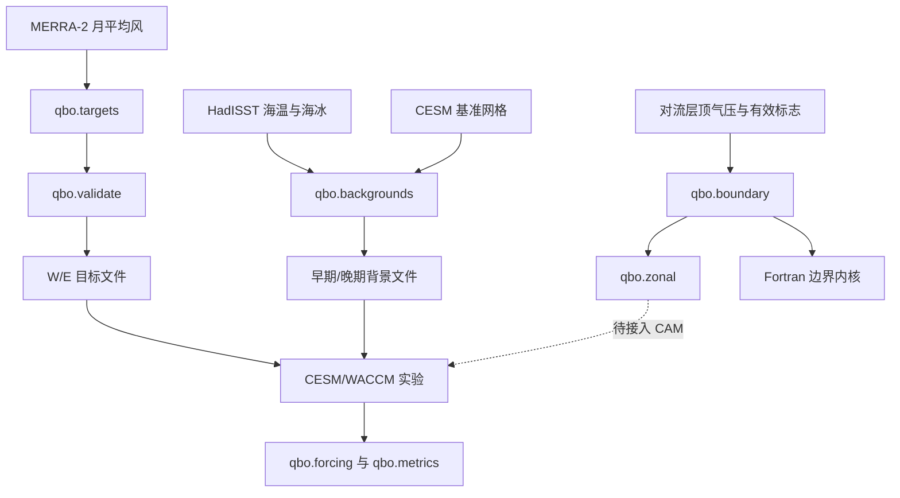

# 架构说明

[English](architecture.md) · [README](../README.zh-CN.md)

代码按实验的数据流组织：构建输入，计算强迫权重，比较模式诊断，验证原生接口。



## 模块分工

| 模块 | 职责 |
|---|---|
| `qbo.targets` | 筛选 QBO 年份，生成 W/E 月廓线 |
| `qbo.backgrounds` | 按时期计算 HadISST 气候态，映射网格并写入背景文件 |
| `qbo.validate` | 检查目标文件的维度、坐标、数值和相位差异 |
| `qbo.boundary` | 确定最严格的对流层顶边界，计算逐柱平滑权重 |
| `qbo.zonal` | 将逐柱权重归约为沿经度一致的包络 |
| `qbo.forcing` | 重建 WACCM 强迫层与 `QBO_U0`，计算对流层顶重叠 |
| `qbo.metrics` | 计算松弛强度保留率，以及纬向和非纬向分量 |
| `qbo.preconditions` | 检查诊断 namelist 和硬截断几何关系 |
| `qbo.native` | 生成边界测试向量，核对 Fortran 结果 |
| `scripts/analysis/` | 读取历史模式证据，输出 JSON/CSV 分析结果 |

Python 包处理数组和显式文件路径。实验档案的目录遍历放在分析脚本中，CAM 源码准备程序放在 `scripts/`，使用仓库内固定版本的上游源码。

## 数值约定

Python 算子的气压单位为 **hPa**，风速单位为 **m s⁻¹**。CAM 的对流层顶诊断使用 Pa，由适配器或分析脚本完成换算。存在完整三维轴时，Python 数组采用 `(level, latitude, longitude)` 顺序；纬圈归约始终沿最后一轴进行，并将该轴保留为长度 1。

`safe_pressure` 接收 TROP、TROPP、TROPF 三组气压和 found 标志。三组气压都须有限且为正，found 大于 0.5；满足时取最小气压，否则返回 NaN，相应柱权重为零。

给定层底气压 `p_bottom` 和安全边界 `p_safe`：

```text
x = clip(log(p_safe / (p_bottom + 0.001)) / 0.2, 0, 1)
weight = x² (3 − 2x)
```

实现中分别计算两个对数。只有 `p_safe > p_bottom + 0.001` 时权重才可能非零。纬圈包络取 `min(weight, longitude)`，因此不会超过任一参与柱的权重。

WACCM 原有强迫范围在目标气压区间两端各包含一个半强度缓冲层，并在模式上下边界处截断。诊断重建保留原有纬度衰减和风速阈值，测试用手算的小网格核对这些规则。

## CAM 接入

v4 适配器在 QBO 开启分支内计算逐柱权重，并将相同权重用于倾向、松弛率诊断和目标风诊断。`scripts/prepare_cam_adapter.py` 核对基准源码及内核哈希，然后生成新的平铺 `SourceMods/src.cam/` 目录和带诊断的测试程序。

v5 设计在物理驱动的 QBO 前后两段之间增加同步点：

```text
完成所有本地 chunk 的 prepare
  → 采样当前对流层顶约束
  → 验证 epoch 和全球柱 ID 的唯一覆盖
  → 按纬度/层执行 MPI_MIN 权重归约
  → 使用各 chunk 保存的上下文执行 resume
```

跨段上下文包含 4 个整数和 4 个缓冲区指针描述符，底层数据仍由原有模式数组持有。QBO 继续读取原 FV 流程生成的 UZM 缓冲。

`native/contract/` 实现独立的 epoch 和逐柱映射检查。测试网格包含 8 柱、2 个纬圈、最多 3 层，覆盖遗漏、重复、映射错误、跨 rank 头信息不一致和重复 epoch。真实网格规模、驱动调用重排及缓冲区生命周期属于后续 CAM 接入工作。

## 验证与来源

Python 测试覆盖数值函数和输入格式。`scripts/check_native.py` 在 GNU/MPI 环境编译运行边界、纬圈和契约测试。CAM 准备测试核对保留过程的代码体以及生成文件的目录结构。

2026 年 9 月的原实验记录包含 4 种 MPI 分配下的 3,998 行纬圈参考结果，以及 12 个通过的契约案例。[历史验证记录](validation-record.json) 单独保存这些结果。适配器的历史结果来自带诊断的测试程序，v5 完整驱动对照仍待完成。

[代码来源表](source-map.json) 记录导入文件的原始哈希，[重构对应表](refactor-map.md) 列出提取函数和新模块。大型证据文件保存在原实验档案中，由分析脚本核对其记录哈希。
